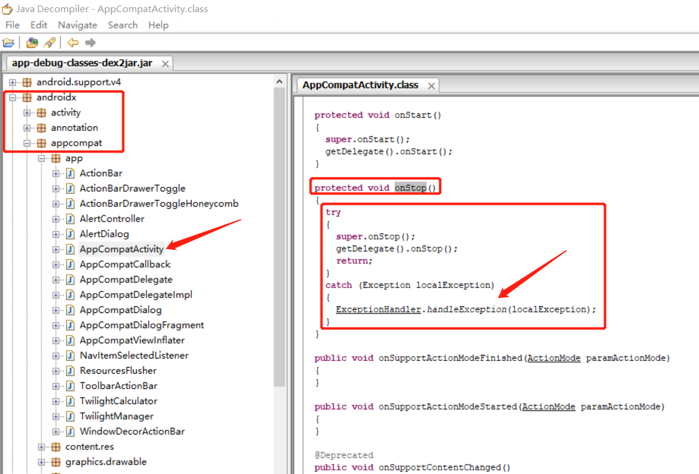

# DxKit： 基于ASM + transform 实现AOP功能的kit

### 1. 支持查看所有点击View的类名和id
add this code into build.gradle
```groovy
apply plugin: 'dxkit-click'
clickExtension {
    canSeeClickId = true
    seeIdClass = "com/dxkit/library/utils/SeeViewId"
    seeIdMethod = "seeViewIdName"
}
```

### 2. 支持click粘连响应拦截
原理说明博文：[Android Transform+ASM添加try catch并返回默认值之明白讲义：https://www.jianshu.com/p/50882f3af59d](https://www.jianshu.com/p/50882f3af59d)
add this code into build.gradle
```groovy
apply plugin: 'dxkit-click'
clickExtension {
    isForbidStickClick = true
    stickClickClass = "com/dxkit/library/utils/FastClickUtil"
    stickClickMethod = "isFastDoubleClick"
}
```

### 3. 支持为指定类的方法添加try catch保护，支持自己代码、第三方jar、第三方aar
add this code into build.gradle
```groovy
    apply plugin: 'dxkit-tryCatch'
    tryCatchExtension {
    // 需要加try catch的类及其中的方法信息
    methodMap = ["com/dxkit/demo/test/CrashTest": ["crashMethod1", "crashMethod2",
                                                         "getInt", "isEnable", "getObj", "getStr", "getChar", "show",
                                                         "getFloat", "getByte", "getDouble", "getShort", "getLong",
                                                         "getArrayObj", "getArrayObj2", "getArrayInt", "getArrayInt2",
                                                         "getArrayBoolean", "getArrayBoolean2", "getList",
                                                        ],

                 "com/dx/tracer/util/NetUtil"  : ["getNetworkType", "getCrashString",],
                  // aar code
                 "com/dx/tracer/FrameFloatView": ["getExtra",],
                 // implementation androidX code
                 "androidx/appcompat/app/AppCompatActivity": ["onStop",],
    ]

    // 用户处理异常信息的类和方法
    exceptionHandler = ["com/dxkit/library/utils/ExceptionHandler": "handleException"]
}
```
#### 支持根据方法签名在发生异常时返回默认
##### 源代码
```java
    public Object getObj() {
        Object object = new Object();
        return object;
    }
    
    public double getDouble() {
        double a = 2.3d;
        return a;
    }

    public long getLong() {
        long a = 1234567L;
        return a;
    }

    public float getFloat() {
        float a = 231234213.45f;
        return a;
    }

    public short getShort() {
        short a = 32767;
        return a;
    }

    public byte getByte() {
        byte a = 127;
        return a;
    }
```
##### ASM处理后
```java
    public Object getObj() {
        try {
            Object object = new Object();
            return object;
        } catch (Exception var2) {
            ExceptionHandler.handleException(var2);
            return null;
        }
    }
    public double getDouble() {
    try {
        double a = 2.3D;
        return a;
    } catch (Exception var3) {
        ExceptionHandler.handleException(var3);
        return 0.0D;
    }

    public long getLong() {
        try {
            long a = 1234567L;
            return a;
        } catch (Exception var3) {
            ExceptionHandler.handleException(var3);
            return 0L;
        }
    }

    public float getFloat() {
        try {
            float a = 2.31234208E8F;
            return a;
        } catch (Exception var2) {
            ExceptionHandler.handleException(var2);
            return 0.0F;
        }
    }

    public short getShort() {
        try {
            short a = 32767;
            return a;
        } catch (Exception var2) {
            ExceptionHandler.handleException(var2);
            return 0;
        }
    }

    public byte getByte() {
        try {
            byte a = 127;
            return a;
        } catch (Exception var2) {
            ExceptionHandler.handleException(var2);
            return 0;
        }
    }
```
具体实现原理请看`TryCatchClassVisitor.java` 和 `ASMUtil.java`

#### 处理 androidX 库AppCompatActivity的onStop方法结果如下：
 

### 更多功能持续更新中...
